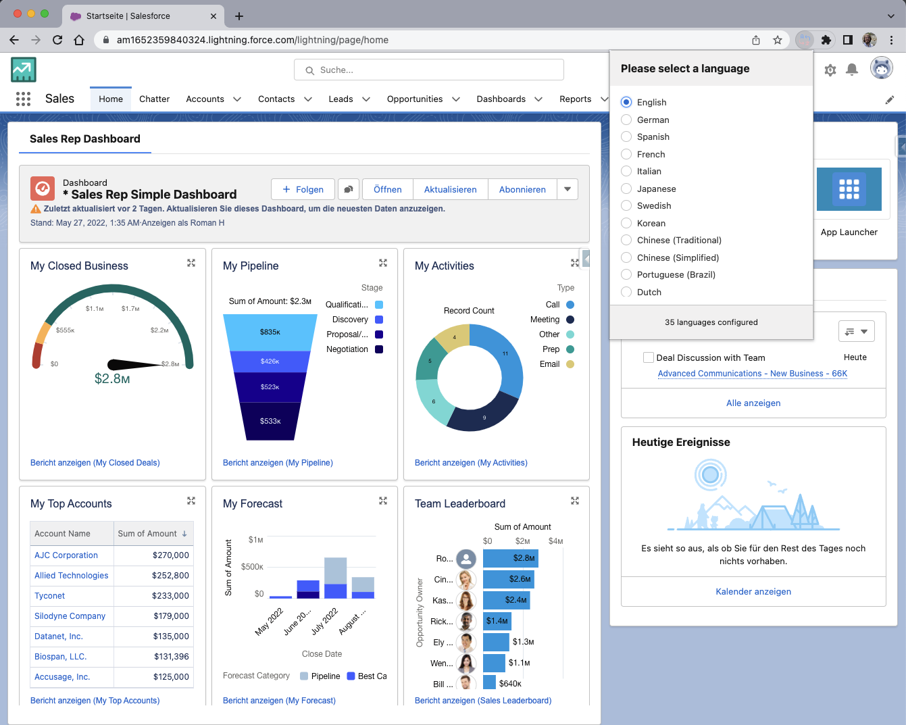

#  Salesforce User Language Switcher for Firefox

This is a port of the [Salesforce User Language Switcher](https://github.com/derroman/salesforce-user-language-switcher) Chrome extension by [Roman Right](https://github.com/derroman) to Firefox.

This little Firefox extension helps Salesforce users to switch their current user language with a single click. 

Working with customers who use their Orgs in multiple languages is always tricky and time-consuming, when it comes to translations and testing these.
In the current version of Salesforce you need 6+ clicks to change your own user language in your personal settings of Salesforce. 
And even worse, as the settings page does not open in a separate tab, you might even lose your current context. Annoying... 

And as we are developers and therefore love to make our lives easier, we've developed this little Firefox extension.

## Features

- Queries all available languages of a Salesforce environment
- Provides a list of languages which can be switch with a single click
- Page will reload automatically after language switch

## Remarks

- Switching to some languages might take a moment to refresh the Page, e.g. "Chinese (Traditional)"
- This extension only works in Salesforce Lightning (who uses Classic these days, anyway...)

## Install

This extension is not yet available on the Firefox Add-on store. You can install it manually by following these steps:
1. Download the latest `sf-language-switcher-firefox.zip` file from the [releases page](https://github.com/YOUR_USERNAME/YOUR_REPOSITORY/releases).
2. Open Firefox and navigate to `about:debugging`.
3. Click on 'This Firefox'.
4. Click on 'Load Temporary Add-on...'.
5. Select the `sf-language-switcher-firefox.zip` file.

## Contribution

Suggestions and pull requests are highly welcome.

---

This project was bootstrapped with [Chrome Extension CLI](https://github.com/dutiyesh/chrome-extension-cli)

Icon source: <a href="https://www.flaticon.com/free-icons/translate" title="translate icons">Translate icons created by Freepik - Flaticon</a>